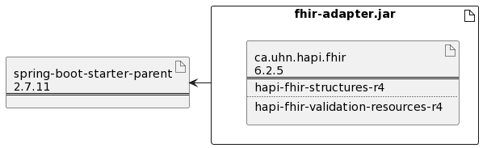

# fhir-adapter


fhir-adapter jar. Wrapper on the fhir library.

## Git

```
cd existing_repo
git remote add origin https://innersource.soprasteria.com/bit/bag/fhir-adapter.git
git branch -M master
git push -uf origin master
```

## Getting started

Install the project with mvn clean install

## Start the application

mvn spring-boot:run

## CI/CD

Use the built-in continuous integration in GitLab.

- [pipelines](https://innersource.soprasteria.com/bit/bag/fhir-adapter/-/pipelines)

## License

 [MIT](License.md)

## Components
TODO


### Deployment
The application contains one main libraries:



* HAPI/FHIR: to handle the document in json format.