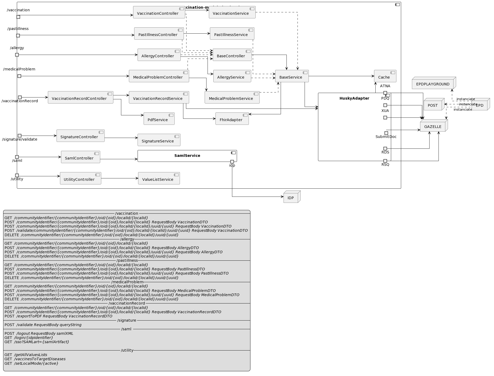
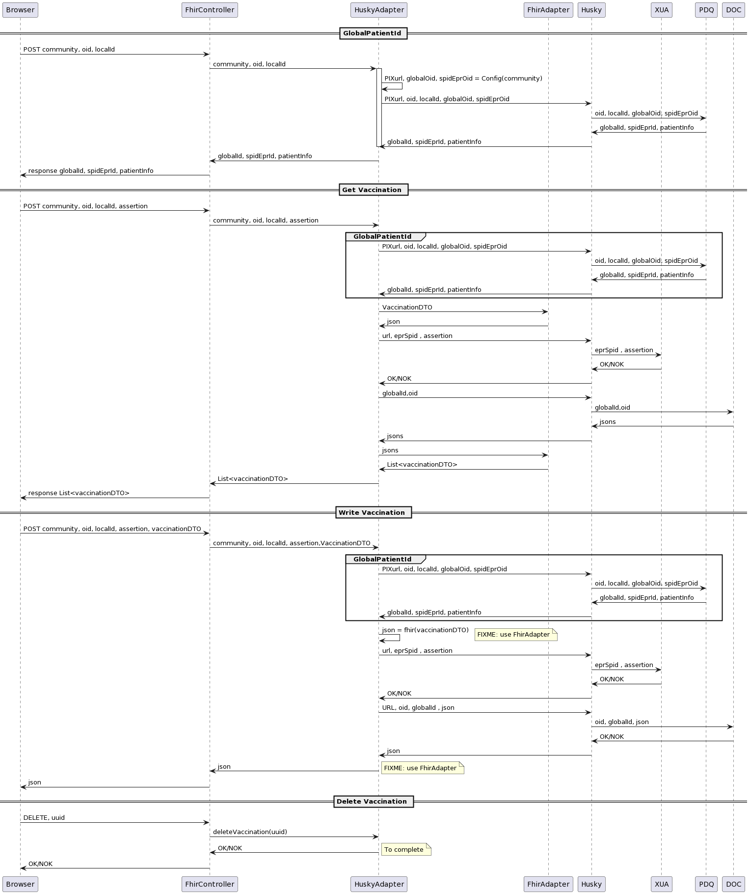
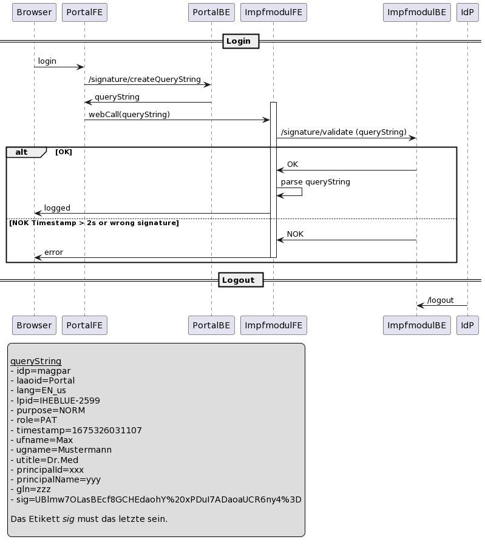
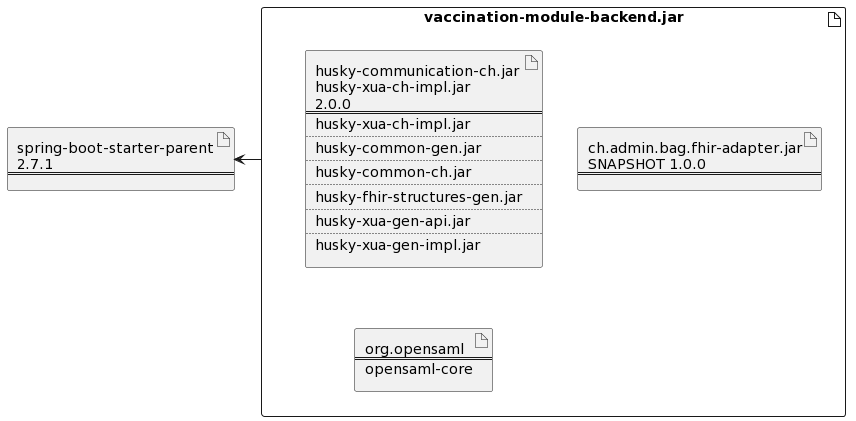

# Vaccination Module Backend


Spring Boot Backend Application

## Git

```
cd existing_repo
git remote add origin https://innersource.soprasteria.com/bit/bag/vaccination-module-backend.git
git branch -M master
git push -uf origin master
```

## Getting started

Install the project with mvn clean install

## Start the application

mvn spring-boot:run

## Swagger
- [Swagger develop](https://develop-vaccination-module-backend.apps.ocp4.innershift.sodigital.io/swagger-ui/index.html)
- [Swagger master](https://master-vaccination-module-backend.apps.ocp4.innershift.sodigital.io/swagger-ui/index.html)

## CI/CD

Use the built-in continuous integration in GitLab.

- [pipelines](https://innersource.soprasteria.com/bit/bag/vaccination-module-backend/-/pipelines)

## License

 [MIT](License.md)

## Overview

### Components
The application is based on REST controller and external libraries.




### Sequences
The sequences of the data exchange of the application is the following:



## Authentication
The authentication is based on [oasis-open.org](http://docs.oasis-open.org/security/saml/Post2.0/sstc-saml-tech-overview-2.0.html).
5.1.3 SP-Initiated SSO: POST/Artifact Bindings
* /saml/login: 
* /saml/sso : Implements the step 5
* /logout: Handle the logout SAML request



As comprehensive description of the parameters is defined in : [04_Interfaces.md](https://github.com/ehealthsuisse/Impfmodul-Phase-I/blob/main/Documentation/DE/04_Interfaces.md)

### Deployment
The application contains 3 main libraries:



* HAPI/FHIR: to handle the document in json format.
* Husky: to access repositories.
* Saml: To manage the saml token.